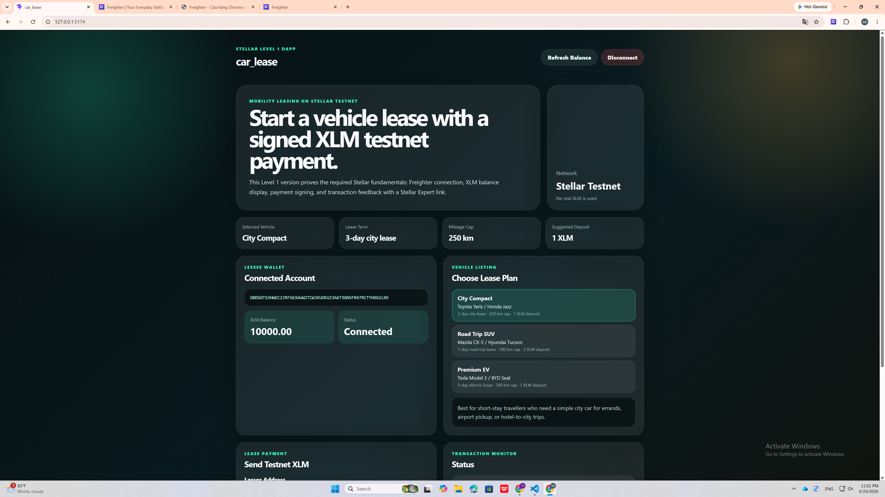
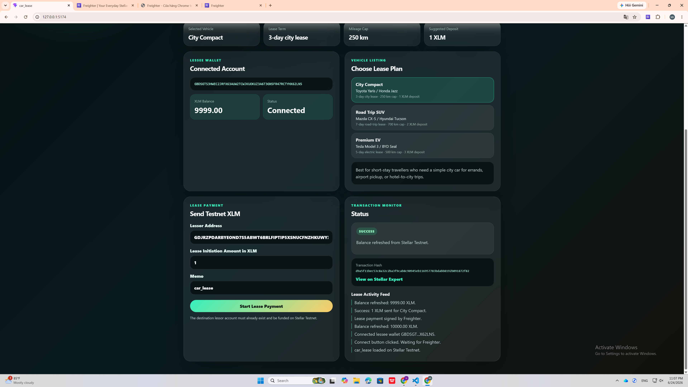

# car_lease

## Project Description

**car_lease** is a Stellar Testnet dApp for starting a vehicle lease payment through a Freighter wallet.

Vehicle leasing today often depends on paperwork, escrow accounts, credit cards, and trusted intermediaries. This Level 1 version of **car_lease** demonstrates the first on-chain step: a lessee connects a Freighter wallet, checks their XLM balance, selects a vehicle lease plan, and sends a testnet XLM lease initiation payment to a lessor address.

This project is built for Stellar Level 1 and focuses on the core fundamentals: wallet connection, wallet disconnection, balance display, transaction signing, transaction status, and transaction hash visibility.

## Project Vision

The long-term vision of **car_lease** is to make short-term vehicle leasing as portable and trust-minimised as sending a payment.

In a future Soroban version, a lessor will be able to publish a vehicle, and a lessee will be able to sign, return, early-terminate, or settle an over-mileage claim on-chain. Lease state such as term, monthly rent, mileage cap, odometer, overage fees, and termination reason can later be stored and verified through a Soroban smart contract.

For Level 1, this project proves the foundation: a user can connect a Stellar wallet, view their XLM balance, and send a real transaction on Stellar Testnet.

## Built With

* Stellar Testnet
* Freighter Wallet
* Stellar SDK
* Freighter API
* React
* TypeScript
* Vite

## Level 1 Requirements Covered

| Requirement                          | Status    |
| ------------------------------------ | --------- |
| Set up Freighter wallet              | Completed |
| Use Stellar Testnet                  | Completed |
| Wallet connect functionality         | Completed |
| Wallet disconnect functionality      | Completed |
| Fetch connected wallet XLM balance   | Completed |
| Display balance clearly in UI        | Completed |
| Send XLM transaction on Testnet      | Completed |
| Show success or failure state        | Completed |
| Show transaction hash / confirmation | Completed |
| Public GitHub repository             | Completed |

## Transaction Proof

* **Network:** Stellar Testnet
* **Transaction Hash:** `d9a5f11bec53c8a32c2ba3f9cab8c90945eb116957783bdabb8192b091872f82`
* **Stellar Expert Link:** https://stellar.expert/explorer/testnet/tx/d9a5f11bec53c8a32c2ba3f9cab8c90945eb116957783bdabb8192b091872f82

## Screenshots

### Wallet Connected + Balance Displayed



### Successful Testnet Transaction



## How to Run Locally

### 1. Clone the repository

```bash
git clone https://github.com/disilami-dev/car_lease.git
cd car_lease
```

### 2. Install dependencies

```bash
npm install
```

### 3. Start the development server

```bash
npm run dev
```

### 4. Open the app

Open the local URL shown in the terminal.

For this project, using a unique local port is recommended:

```bash
npm run dev -- --host 127.0.0.1 --port 5174
```

Then open:

```bash
http://127.0.0.1:5174/
```

## How to Use

1. Install the Freighter wallet extension.
2. Switch Freighter to Stellar Testnet.
3. Fund your Testnet wallet.
4. Open the app locally.
5. Click **Connect Freighter**.
6. Confirm the connection in Freighter.
7. View your connected wallet address and XLM balance.
8. Choose a vehicle lease plan.
9. Enter a funded Stellar Testnet lessor address.
10. Enter the lease initiation amount in XLM.
11. Click **Start Lease Payment**.
12. Approve the transaction in Freighter.
13. View the success message, transaction hash, and Stellar Expert link.

## Project Structure

```text
car_lease
├── screenshots
│   ├── wallet-balance.png
│   └── transaction-success.png
├── src
│   ├── App.css
│   ├── App.tsx
│   └── main.tsx
├── .gitignore
├── README.md
├── index.html
├── package.json
├── package-lock.json
├── tsconfig.json
├── tsconfig.app.json
├── tsconfig.node.json
└── vite.config.ts
```

## Notes

This is the Level 1 version of **car_lease**.

The current app does not use a Soroban smart contract yet. The Soroban contract version will be added in a future Level 2 version, where lease state and actions can be enforced directly on-chain.
